# Fase 2: SIEM Wazuh

## Tujuan
Membangun SIEM (Security Information and Event Management) menggunakan Wazuh untuk mengumpulkan, menganalisis, dan mendeteksi ancaman dari seluruh endpoint di jaringan lab.

## Tools yang Digunakan
- Wazuh 4.14 (Indexer, Server/Manager, Dashboard — all-in-one installer)
- Ubuntu Server 22.04 LTS
- Sysmon 15.21 (Windows endpoint logging)
- Filebeat 7.10.2
- Windows Server 2022, Windows 11 (agent)
- pfSense CE 2.8.1 (syslog forwarding)

## Arsitektur Final (Setelah VLAN)
| Komponen | IP |
|----------|-----|
| Wazuh Server (Ubuntu 22.04) | 192.168.20.30 (SERVER VLAN 20) |
| Dashboard | https://192.168.56.104 (Host-Only) |
| Agent Windows Server | 192.168.20.10 (SERVER VLAN 20) |
| Agent Windows 11 | 192.168.30.10 (ENDPOINT VLAN 30) |
| Agent DVWA | 192.168.20.40 (SERVER VLAN 20) |
| pfSense Log Forwarding | syslog UDP 514 → Wazuh archives |

## Komponen Status
| Komponen | Status |
|----------|--------|
| Wazuh Indexer | ✅ Running |
| Wazuh Manager | ✅ Running |
| Wazuh Dashboard | ✅ Running |
| Agent Windows Server (ID 001) | ✅ Active |
| Agent Windows 11 (ID 002) | ✅ Active |
| Agent DVWA (ID 003) | ✅ Active |
| Sysmon | ✅ Running |
| pfSense Log Forwarding | ✅ Archives |

## Kredensial
- User: `admin`
- Password: *(tersimpan di `wazuh-install-files.tar` → `wazuh-passwords.txt`)*

## Langkah yang Dilakukan
1. Update sistem Ubuntu, konfigurasi static IP dan DNS
2. Pre-check port 443/80 sebelum instalasi
3. Download dan jalankan installer Wazuh (`wazuh-install.sh -a`)
4. Verifikasi akses dashboard dan catat kredensial admin
5. Buka port firewall (UFW) untuk komunikasi agent (1514, 1515, 55000, 443)
6. Install Wazuh Agent di Windows Server dan Windows 11
7. Install Sysmon di kedua endpoint Windows, hubungkan log ke Wazuh Agent
8. Konfigurasi pfSense remote syslog ke Wazuh (UDP 514)
9. Update konfigurasi agent dan pfSense setelah perubahan IP VLAN
10. Verifikasi semua agent berstatus Active di dashboard

## Troubleshooting Utama

### Instalasi Wazuh
| Masalah | Solusi |
|---------|--------|
| Ubuntu 26.04 dashboard gagal install | OS belum didukung — turunkan ke Ubuntu 22.04 LTS |
| Indexer timeout ±25 menit | Naikkan RAM VM, extend `TimeoutStartSec` |
| Disk penuh 100% (`/var/ossec` 17GB) | Resize LVM dari 29GB ke 57GB |
| SSL error | Reinstall bersih dengan installer resmi |

### pfSense Log Forwarding
| Masalah | Solusi |
|---------|--------|
| `tcpdump` 0 packets | Aktifkan "Log packets" di firewall rule pfSense |
| `filterlog` tidak terkirim | Hapus pengecualian `!filterlog` di `pfSense.conf` |
| Syslog ditolak Wazuh | Daftarkan pfSense sebagai agent, update `allowed-ips` |

### Konfigurasi pfSense (Remote Syslog)
- Remote Syslog Server: `192.168.20.30:514`
- Source Address: `SERVER` (`192.168.20.1`)
- Centang **Firewall Events**
- Hapus pengecualian `!filterlog` di `/var/etc/syslog.d/pfSense.conf`

### Konfigurasi Wazuh (ossec.conf)
```xml
<remote>
  <connection>syslog</connection>
  <port>514</port>
  <protocol>udp</protocol>
  <allowed-ips>192.168.20.1</allowed-ips>
</remote>
```

### Konfigurasi Wazuh (`ossec.conf`)

```<address>192.168.20.30</address>```


### Contoh Data pfSense (dari `archives.json`):

```json
{
  "predecoder": {
    "program_name": "filterlog",
    "hostname": "pfsense.home.arpa"
  },
  "decoder": { "name": "pf" },
  "data": {
    "protocol": "udp",
    "action": "pass",
    "srcip": "192.168.1.20",
    "srcport": "49957",
    "dstip": "8.8.8.8",
    "dstport": "53"
  },
  "location": "/var/log/pfSense.log"
}
```

### Konfigurasi Network Ubuntu (netplan)

```yaml
network:
  ethernets:
    enp0s3:
      dhcp4: no
      addresses: [192.168.1.30/24]
      routes:
        - to: default
          via: 192.168.1.1
      nameservers:
        addresses: [192.168.1.1, 8.8.8.8]
  version: 2
```


## Screenshot

### Instalasi Wazuh

### Instalasi Wazuh
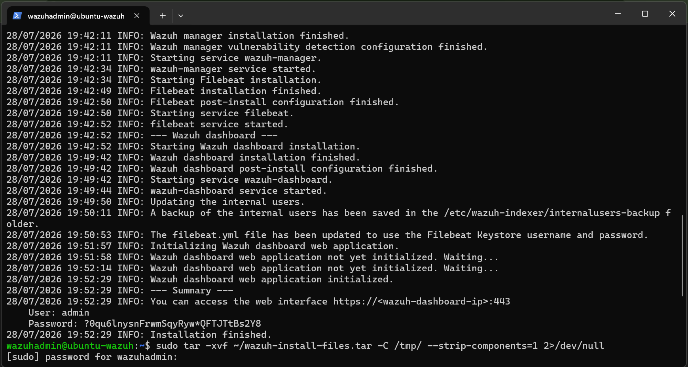
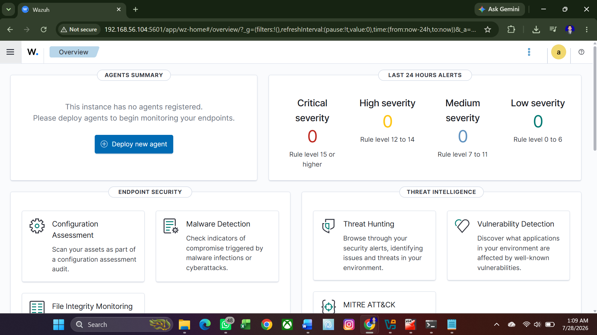

### Agents
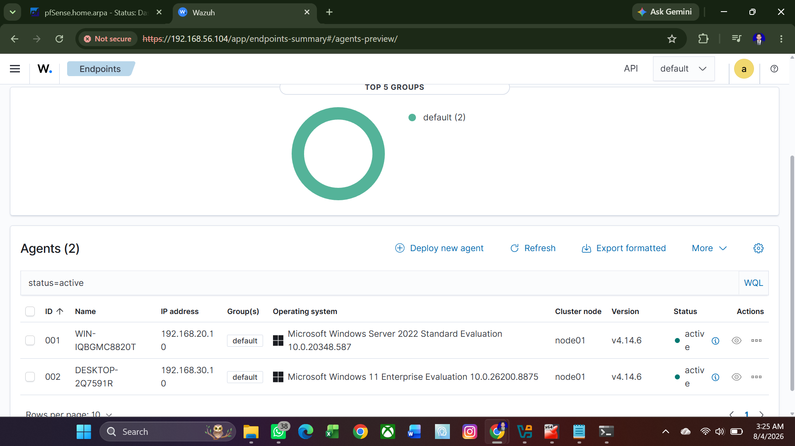
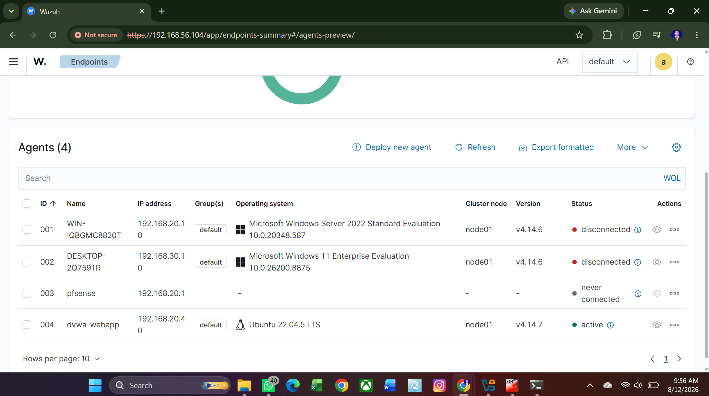
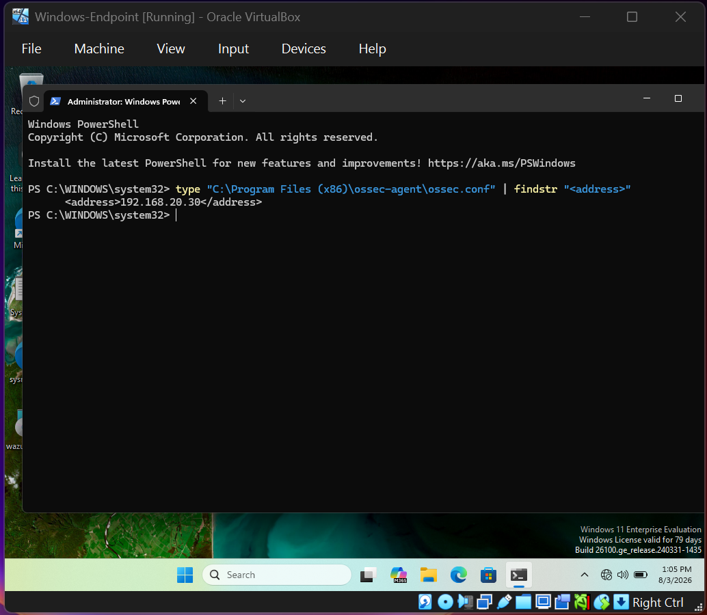

### Sysmon
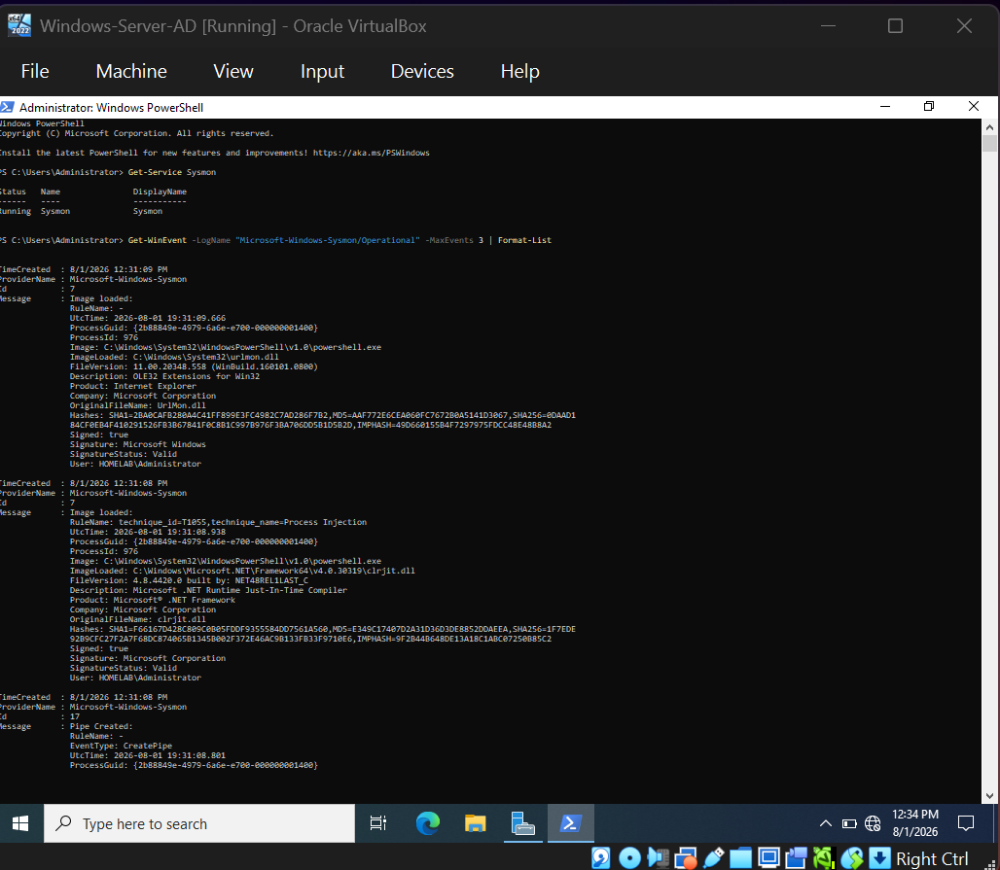
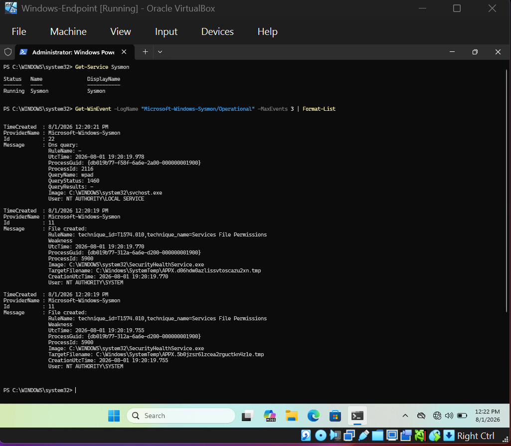

### Alerts
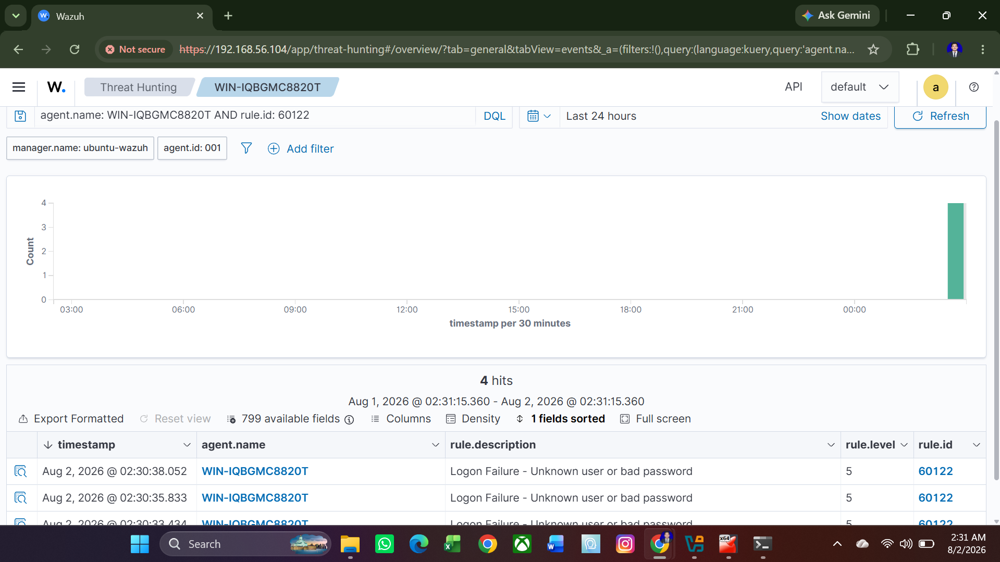
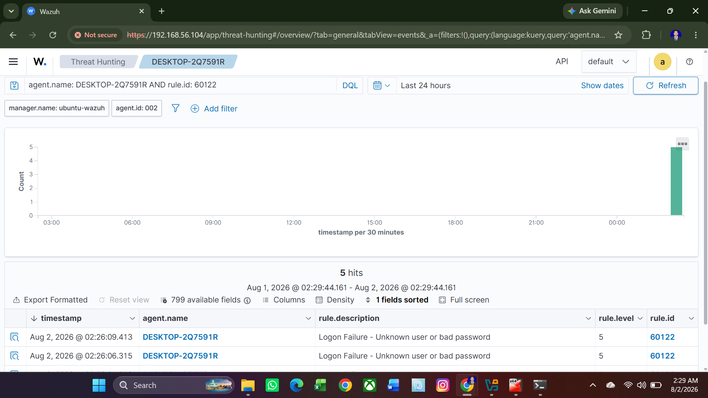

### pfSense Log Forwarding
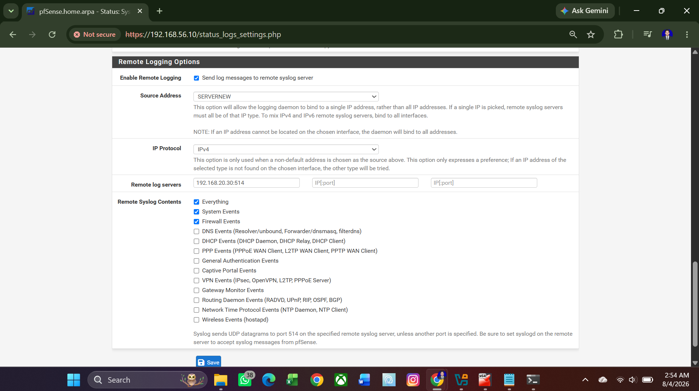
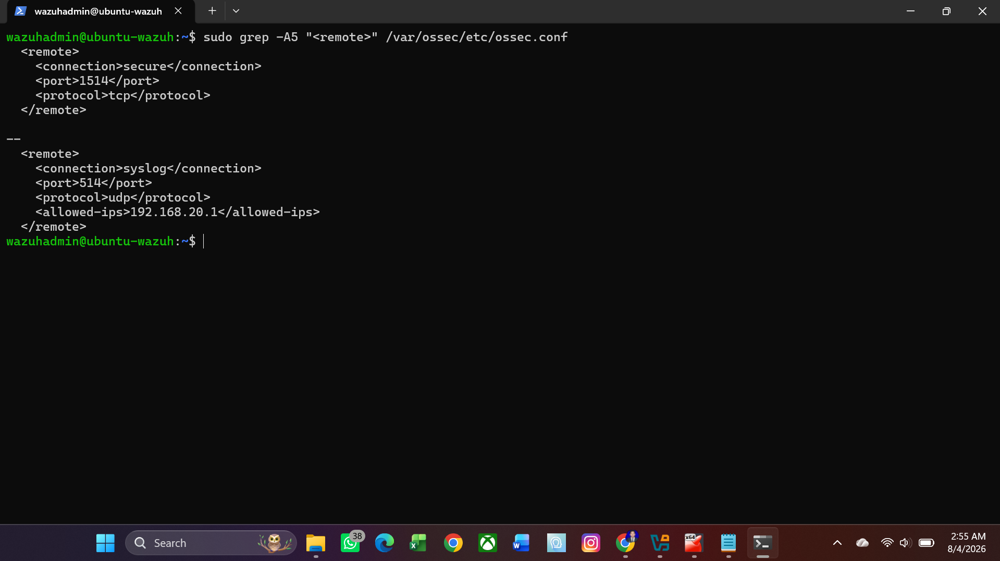
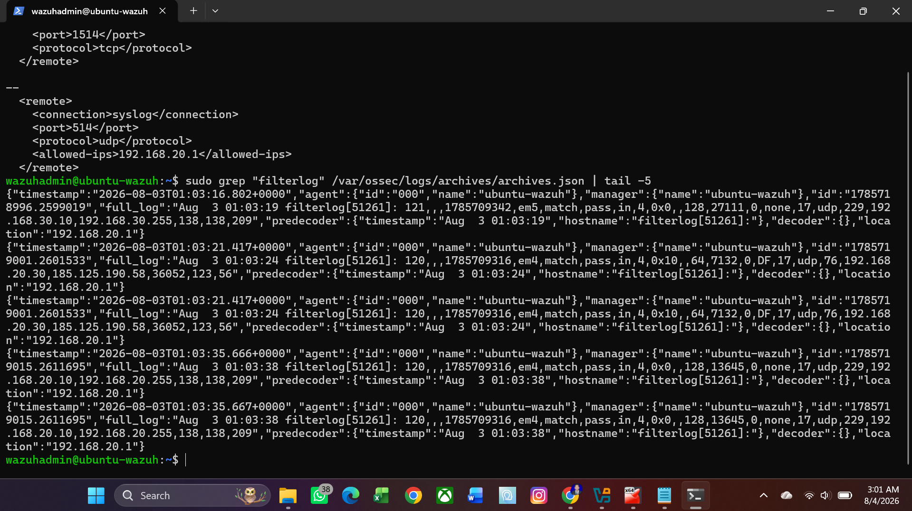

