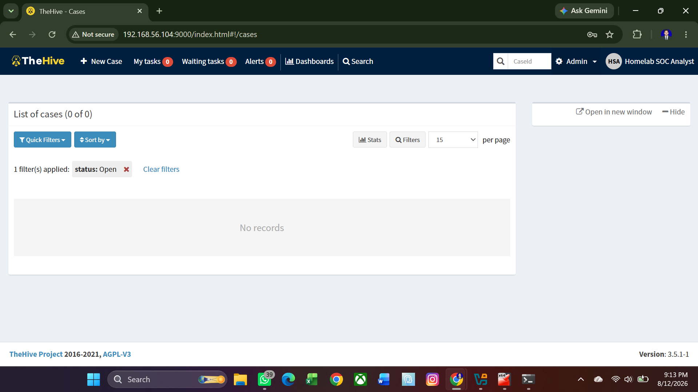
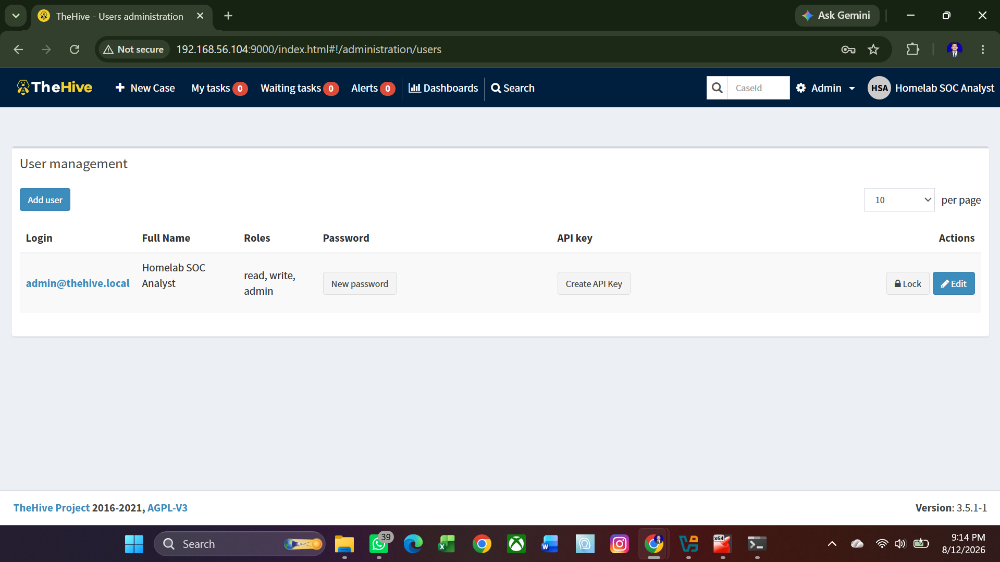
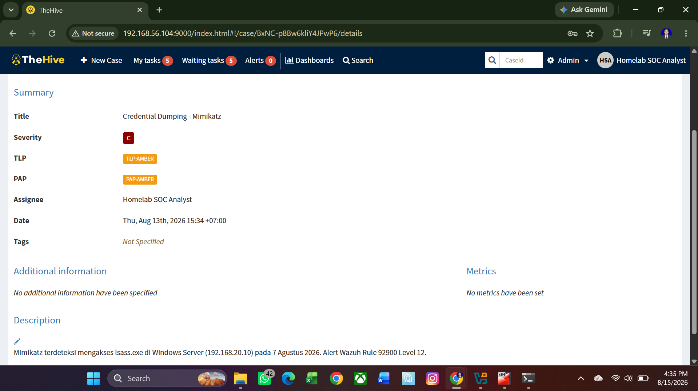
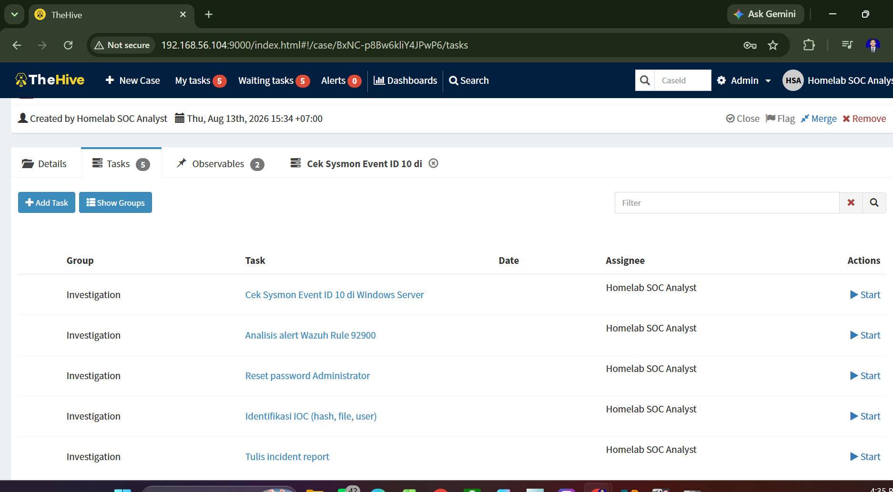
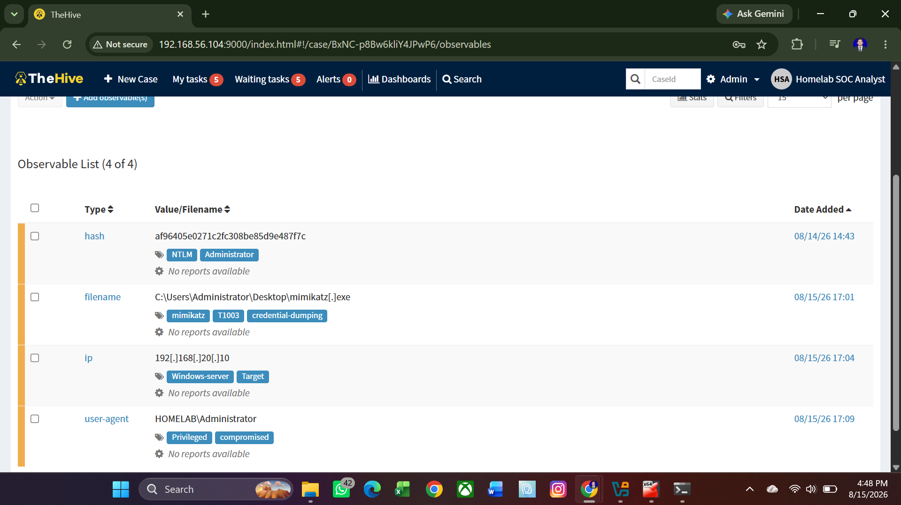

# Fase 4: Incident Response

## Tujuan
Melatih proses investigasi insiden end-to-end menggunakan TheHive, dari triage alert sampai penulisan incident report resmi.

## Tools yang Digunakan
- TheHive 3.5.1 (Case Management)
- Elasticsearch 7.17.0 (Database)
- Docker (Container runtime)
- Wazuh (sumber alert)

## Case yang Diinvestigasi
**Case 4: Credential Dumping via Mimikatz**
- MITRE ATT&CK: T1003
- Severity: Critical (Level 12)
- Target: Windows Server (192.168.20.10)

## Langkah yang Dilakukan
1. Install Elasticsearch + TheHive via Docker
2. Buat case di TheHive
3. Tambah task investigasi (5 task)
4. Tambah IOC (file, hash, IP, user)
5. Tulis incident report resmi

## Ringkasan Investigasi

### Deteksi Awal
Wazuh alert **Rule 92900 Level 12** — "Lsass process was accessed by mimikatz.exe"

### Timeline
| Waktu (UTC) | Kejadian |
|-------------|----------|
| 00:05 | Windows Defender dimatikan |
| 00:07:02 | mimikatz.exe dijalankan |
| 00:07:12 | mimikatz.exe mengakses lsass.exe |
| 00:08:54 | Wazuh trigger alert Level 12 |

### IOC (Indicator of Compromise)
| Tipe | Nilai | Tags |
|------|-------|------|
| File | C:\Users\Administrator\Desktop\mimikatz.exe | mimikatz,T1003 |
| Hash NTLM | af96405e0271c2fc308be85d9e487f7c | ntlm,administrator |
| IP Target | 192.168.20.10 | windows-server,target |
| User | HOMELAB\Administrator | privileged,compromised |

### Root Cause
Windows Defender dinonaktifkan, tidak ada LSA Protection, dan user menjalankan executable tidak dikenal dengan hak Administrator.

### Rekomendasi
1. Enable Attack Surface Reduction (ASR) rules
2. Implement LSA Protection
3. Audit privileged account usage
4. Deploy application whitelisting
5. Konfigurasi alert Defender ke Wazuh

## Hasil
- ✅ TheHive berjalan dengan Elasticsearch
- ✅ Case lengkap dengan task & IOC
- ✅ Incident Report tersedia di `incident-report.md`

## Screenshot

#### TheHive Login

#### TheHive User

#### TheHive Case

#### TheHive Tasks

#### TheHive IOC

#### Wazuh Proof

#### Incident Response
[Incident Report](reports/incident-report.md)