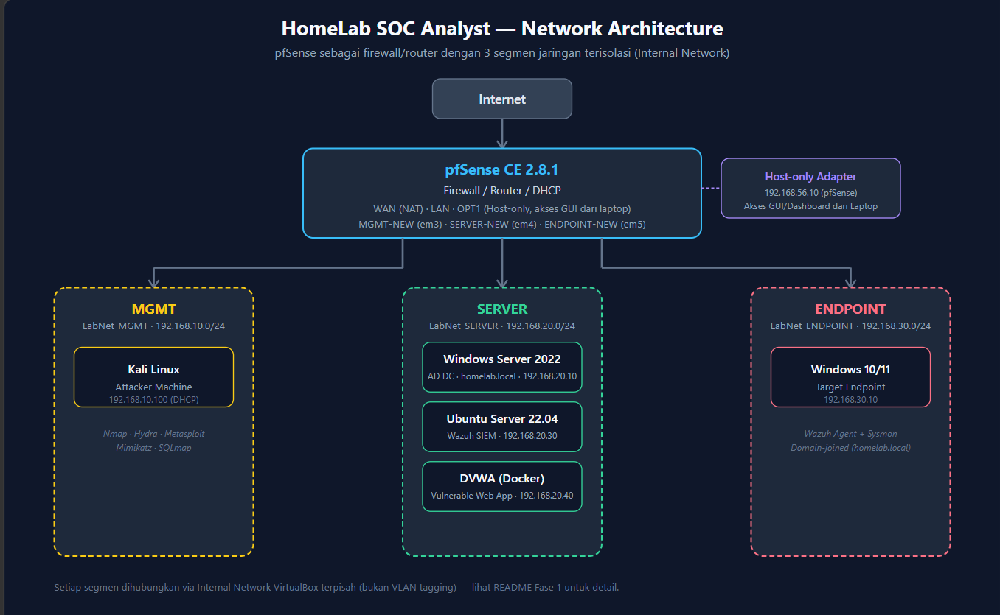

# HomeLab SOC Analyst

Project homelab ini saya bangun sendiri dari nol sebagai sarana belajar dan pembuktian skill. Semua konfigurasi, troubleshooting, dan dokumentasi saya kerjakan mandiri mulai dari setup jaringan dengan VLAN, deploy SIEM Wazuh, mengirim log dari pfSense dan Windows, sampai simulasi serangan dan analisis detection-nya.

---

## 👤 Tentang Saya

Saya adalah seorang **Network Engineer** yang sedang bertransisi ke bidang Cyber Security. Project ini saya bangun untuk mempraktikkan dan mendemonstrasikan kemampuan monitoring, deteksi ancaman, dan incident response menggunakan tools yang umum dipakai di industri.

* LinkedIn:https://www.linkedin.com/in/mhd-iqball/
* Email: mhdibll17@gmail.com
* No. HP : 08529236259

---

## 🎯 Tujuan Project

* Membangun homelab yang mensimulasikan lingkungan enterprise kecil (Active Directory, endpoint, firewall)
* Mengimplementasikan SIEM untuk log collection \& monitoring
* Melakukan simulasi serangan berbasis **MITRE ATT\&CK** dan membangun detection rule
* Melatih proses incident response dari triage sampai reporting
* Menunjukkan kemampuan analisis dan dokumentasi teknis untuk persiapan melamar sebagai SOC Analyst

---

## 🏗️ Arsitektur

Ringkasan arsitektur:

* **Firewall/Router**: pfSense dengan segmentasi VLAN (Management, Server, Endpoint)
* **Domain**: Windows Server + Active Directory
* **Endpoint**: Windows 10/11, Ubuntu Server
* **Attacker Machine**: Kali Linux
* **SIEM**: Wazuh 4.14.6
* **Case Management**: TheHive

---

## 🛠️ Tools yang Digunakan

|Kategori|Tools|
|-|-|
|Virtualisasi|VirtualBox|
|Firewall & Network|pfSense|
|SIEM/XDR|Wazuh 4.14.6|
|Endpoint Logging|Sysmon 15.21, Windows Event Log|
|Simulasi Serangan|Kali Linux (Nmap, Hydra, Metasploit, Mimikatz)|
|Case Management/IR|TheHive|
|Threat Intelligence|MISP (planned)|
|Detection Rules|Sigma rules (planned)|
|Framework Referensi|MITRE ATT\&CK|

---

## 📂 Struktur Project

|Folder|Deskripsi|
|-|-|
|[`01-network-setup`](./01-network-setup)|etup jaringan, VLAN, firewall rules, Active Directory|
|[`02-siem-wazuh`](./02-siem-wazuh)|Instalasi \& konfigurasi Wazuh, log source integration|
|[`03-detection-engineering`](./03-detection-engineering)|Simulasi serangan, mapping MITRE ATT\&CK|
|[`04-incident-response`](./04-incident-response)|Case management, incident report|
|[`diagrams-architecture`](./diagrams)|Diagram arsitektur jaringan|

---

## 🚀 Progress / Roadmap

* [x] Setup infrastruktur dasar (VirtualBox, pfSense, VLAN, Active Directory)
* [x] Instalasi \& konfigurasi SIEM (Wazuh)
* [x] Log integration (Sysmon, Windows Event Log, pfSense firewall log)
* [x] Simulasi serangan Tier 1-3 (6 case MITRE ATT\&CK)
* [x] Incident response case study (TheHive + incident report)
* [ ] Suricata NIDS
* [ ] VirusTotal integration
* [ ] MISP Threat Intelligence
* [ ] Custom detection rules (Sigma)

---

## 🔍 Highlight / Key Findings

* *Troubleshooting VLAN: Driver VirtualBox tidak mendukung VLAN tagging → diatasi dengan Internal Network terpisah via VBoxManage CLI*
* *pfSense Log Forwarding: Debugging dari tcpdump 0 packets → menemukan pengecualian `!filterlog` di pfSense.conf → berhasil mengirim firewall log ke Wazuh archives*
* *Wazuh Instalasi: Mengalami disk penuh, indexer timeout, SSL error → teratasi dengan resize LVM, turunkan heap Java, reinstall bersih*
* *Case 1 (Nmap): Wazuh tidak mendeteksi port scan → temuan penting bahwa HIDS butuh custom rule untuk network detection*
* *Case 2 (Hydra): Default rule Wazuh (5760) berhasil mendeteksi brute force SSH*
* *Case 3 (Metasploit): EternalBlue gagal (target patched) → SMB Delivery berhasil menangkap NTLMv2 hash*
* *Case 4 (Mimikatz): Terdeteksi sempurna oleh Sysmon (Event ID 10) + Wazuh (Rule 92900 Level 12)*
* *Case 5 (WMI): Lateral movement terdeteksi Sysmon + Wazuh*
* *Case 6 (SQLi): Manual exploitation berhasil (error 500 + dump users)*
* *Incident Response: Case lengkap di TheHive + incident report formal*

---

## 📌 Catatan

Seluruh konfigurasi, IP address, dan kredensial pada dokumentasi ini telah disamarkan untuk keperluan publikasi. Project ini dibangun murni untuk tujuan pembelajaran di lingkungan lab yang terisolasi.

